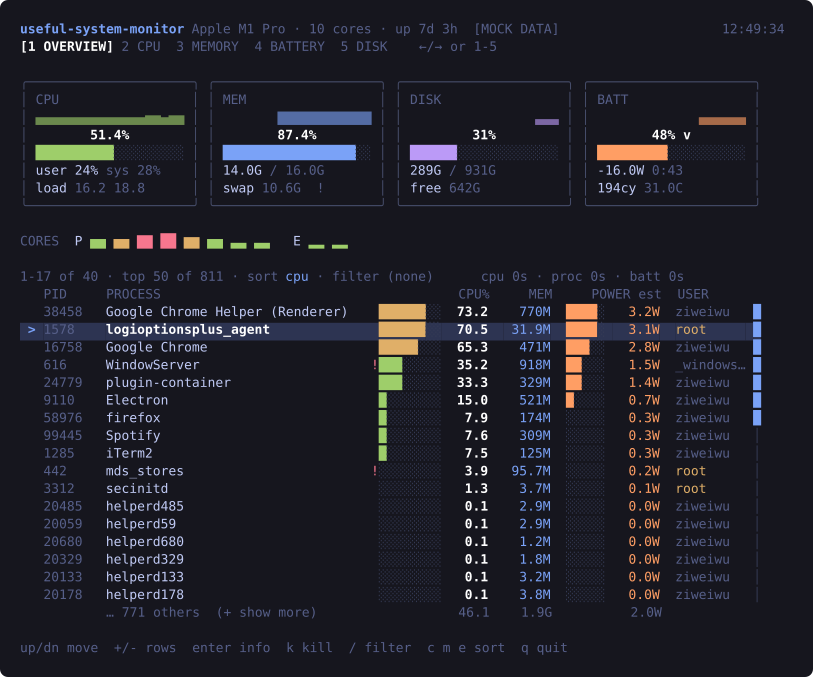
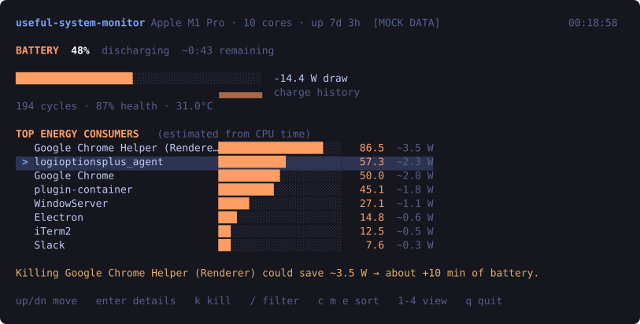

# useful-system-monitor

**Your Mac is hot, the fan is loud, and the battery says two hours. Which app is
doing it?**

`useful-system-monitor` answers that in one screen. It ranks every process by
what it actually costs you — CPU, memory, and *watts* — and lets you kill the
offender without taking your session down with it.



`top` and `htop` show CPU and memory but cannot tell you what is draining the
battery, and offer no guardrails when you kill something. Activity Monitor knows
both and is a GUI you have to leave the terminal for. This sits in the gap.

- **Ranks by real cost.** Instantaneous CPU (not the lifetime average `ps`
  reports), resident memory, and an estimated wattage per process.
- **Names the battery culprit.** A dedicated battery view turns the ranking into
  a decision: *killing this saves ~3.5 W, about ten more minutes.*
- **Kills safely.** Critical system processes are refused outright, your own
  ancestors are protected, and a recycled PID aborts the kill instead of hitting
  something innocent.
- **Costs almost nothing to run.** 1.3% of one core, measured — a monitor that
  drains your battery would be a bad joke.
- **Reads clearly.** One colour per metric, severity only where high means bad,
  and every state legible without colour at all.

## Install

**Try it without installing anything:**

```sh
npx useful-system-monitor
```

**Or install it properly:**

```sh
npm install -g useful-system-monitor
useful-system-monitor
```

That's it — no config, no setup, no permissions to grant. macOS only (see
[Requirements](#requirements)).

Typing the full name gets old, so most people add:

```sh
echo "alias usm='useful-system-monitor'" >> ~/.zshrc && source ~/.zshrc
```

<details>
<summary>Run the latest from GitHub, or from source</summary>

```sh
# straight from the repo, no publish needed
npx github:ziweiwu/useful-system-monitor

# from a clone
git clone https://github.com/ziweiwu/useful-system-monitor.git
cd useful-system-monitor
npm install          # builds automatically
npm start            # live
npm run mock         # scripted data, no system access
```
</details>

## Keys

| Key | Action |
|---|---|
| <kbd>↑</kbd> <kbd>↓</kbd> | move selection |
| <kbd>enter</kbd> | process detail — full command line, parent, start time, history |
| <kbd>k</kbd> | kill the selected process |
| <kbd>/</kbd> | filter by name or PID |
| <kbd>c</kbd> <kbd>m</kbd> <kbd>e</kbd> | sort by CPU, memory, energy |
| <kbd>1</kbd>–<kbd>4</kbd> | overview, CPU, memory, battery |
| <kbd>r</kbd> | refresh now |
| <kbd>q</kbd> | quit |

## What's killing your battery



The battery view ranks processes by energy and converts the ranking into a
decision: *killing this saves ~3.5 W, about ten more minutes.*

Energy is estimated from CPU time by default and labelled `est`. Pass
`--energy=accurate` to use macOS's real Energy Impact — the number Activity
Monitor shows — which costs about 1 second of CPU per sample and so is opt-in.

## Killing things safely

The kill path is the part most likely to ruin your day, so it is guarded:

- **Critical processes are refused outright** — `WindowServer`, `launchd`,
  `loginwindow` and friends — with the consequence spelled out, not a bare
  "not allowed".
- **Your own ancestors are refused**, so you cannot take down the shell you are
  running in.
- **The target is bound to (pid, start time).** If the PID gets recycled between
  selecting a row and confirming, the kill aborts instead of hitting an
  unrelated process.
- **SIGTERM is the default**; SIGKILL needs a second, distinct keypress.
- **Permission errors explain the remedy** and never silently escalate to sudo.

## Options

```
--mock              Scripted data; touches nothing on your system
--json              One-shot JSON, for scripting
--top N             Rows in one-shot output (default 10)
--sort cpu|mem|energy
--interval SECONDS  Refresh interval (default 10)
--energy=accurate   Real macOS Energy Impact instead of the estimate
-h, --help
```

It behaves like a normal Unix tool: no TTY means no dashboard, so
`useful-system-monitor --json | jq '.processes[0]'` composes, errors go to
stderr, and exit codes are meaningful. `NO_COLOR` is honoured, and every state
is readable without colour.

## Requirements

- **macOS.** The collectors read `ps`, `vm_stat`, `df`, `pmset` and `ioreg`.
  `package.json` declares `os: ["darwin"]`, so npm refuses to install elsewhere
  rather than letting you install something that cannot work. Linux support
  would mean one new file behind the existing `MetricsProvider` interface —
  PRs welcome.
- **Node 20 or newer.**
- **No elevated permissions.** Killing processes you do not own needs sudo, and
  the tool tells you so rather than escalating on its own.

## It does not drain the battery it monitors

Measured on an M1 Pro: **1.31% of one core** — about 1.00% drawing the screen
and 0.31% reading the system.

Getting there meant discarding some intuitions. The naive design cost 16% of a
core, and the surprises were:

- **Rendering costs more than measuring.** One frame is ~30 ms of layout and
  terminal diffing; every collector combined is ~3 ms/s. Reducing render
  frequency is the only lever that reliably works — `React.memo` changed
  nothing, because the cost is inside the terminal layout, not React.
- **"Free to collect" is not "free to display."** `os.cpus()` costs ~0 ms, which
  is a bad reason to poll it every second: the render it triggers is the cost.
- **macOS's own Energy Impact is expensive to ask for** — ~1 s of CPU per
  sample, roughly 5x this tool's entire budget — hence the cheap estimate by
  default.

Some accounting had to be corrected too. `top` reports memory used as
total-minus-free, which reads 99.5% and is useless; this reports wired + active
+ compressed, Activity Monitor's definition, which read 76.6% at the same
instant. And `df`'s Used column for `/` is the sealed read-only APFS snapshot,
which shows a 926 GB disk as 1% full — real usage is total minus available.

## Correctness

The behaviours this tool promises are written down as numbered invariants in
[INVARIANTS.md](./INVARIANTS.md), and each has a test named after it:

```sh
npm test                      # 126 tests
npx vitest run -t "I-16"      # just the PID-reuse guard
```

The two that matter most: the kill target is bound to `(pid, startTime)` so a
recycled PID can never be killed by mistake (I-16), and selection is keyed by
PID rather than row index, so a re-sort arriving mid-keystroke cannot slide a
different process under the cursor (I-21).

## Screenshots

The images above are generated from the real app, not redrawn:

```sh
npm run screenshot:svg          # regenerates docs/screenshot.svg
```

They are SVG so they stay crisp and text-selectable. To use a real terminal
capture instead, drop a PNG at `docs/screenshot.png` and point the image at it —
a native capture will render block characters exactly as your terminal font
does.

## Contributing

```sh
npm install
npm test && npm run lint && npm run typecheck
npm run mock         # iterate on the UI without touching the system
```

Useful extras: `npm run verify:kill` exercises the real signal path against a
disposable process, and `npm run verify:selfcost` measures how much CPU the app
itself burns.

If you change anything in `src/providers/`, add a fixture in `test/fixtures/`
captured from real command output — the parsers are tested against actual macOS
output, including the awkward cases (process names containing spaces, hour-scale
CPU times, and the unsigned 64-bit wrap that makes a discharging battery report
`18446744073709548164` milliamps).

## License

MIT © [Ziwei Wu](https://github.com/ziweiwu)
