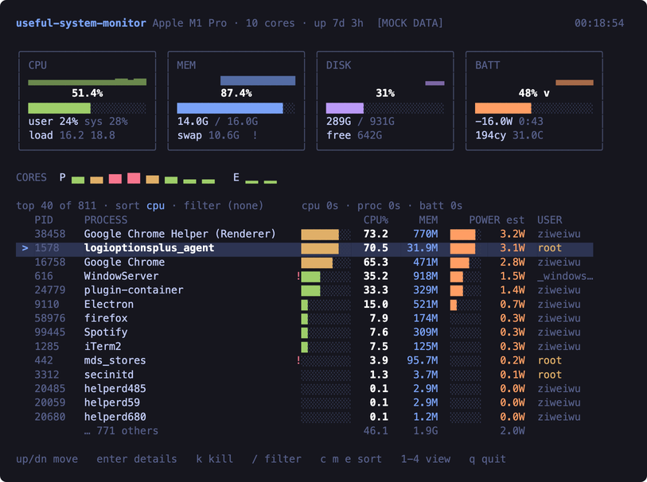
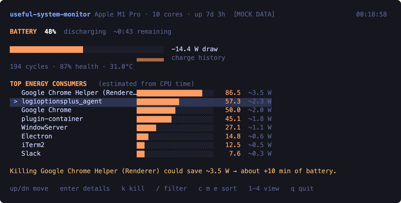

# useful-system-monitor

[](https://www.npmjs.com/package/useful-system-monitor)
[](https://github.com/ziweiwu/useful-system-monitor/actions/workflows/ci.yml)
[](./LICENSE)
[](#requirements)
[](https://github.com/sponsors/ziweiwu)

See what's using up your Mac — and close the apps that are hogging it.

It shows your CPU, memory, disk and battery at a glance, lists the apps using
the most of each, and lets you quit any of them without leaving the terminal.

## Install

```sh
npx useful-system-monitor
```

Or install it so you can run it any time:

```sh
npm install -g useful-system-monitor
useful-system-monitor
```

Works on a Mac. Nothing to set up.

Want a shorter name to type?

```sh
echo "alias usm='useful-system-monitor'" >> ~/.zshrc && source ~/.zshrc
```



## Using it

| Key | What it does |
|---|---|
| <kbd>↑</kbd> <kbd>↓</kbd> | pick an app |
| <kbd>enter</kbd> | see more about it |
| <kbd>k</kbd> | close it |
| <kbd>/</kbd> | search |
| <kbd>c</kbd> <kbd>m</kbd> <kbd>e</kbd> | sort by CPU, memory, or battery use |
| <kbd>1</kbd>–<kbd>4</kbd> | switch between the four screens |
| <kbd>q</kbd> | quit |

## Finding what's draining your battery



Press <kbd>4</kbd> to see how much power is left, how fast it's going, and which
apps are responsible — with an estimate of how much time you'd get back by
closing one.

## Closing apps safely

You can't accidentally break your Mac with it. Apps that macOS needs to keep
running are off limits, and so is the terminal you're using. It asks an app to
close politely first, and if the app has already closed on its own, it won't
hit something else by mistake.

## Extras

```
--mock              Try it with fake data, without touching your system
--json              Print the numbers instead of the dashboard
--top N             How many apps to list (default 10)
--sort cpu|mem|energy
--interval SECONDS  How often to refresh (default 10)
--energy=accurate   More precise battery numbers, at a small cost in speed
-h, --help
```

## Requirements

A Mac, and [Node.js](https://nodejs.org) 20 or newer. Linux isn't supported yet
— contributions welcome.

Running it barely costs anything: about 1% of one CPU core. A monitor that ran
your battery down would rather defeat the point.

## Contributing

```sh
npm install
npm test
npm run mock         # work on the interface without touching your system
```

The behaviour it promises is written down in [INVARIANTS.md](./INVARIANTS.md),
and every item there has a test. If you touch anything that reads from the
system, please add a sample of the real command output to `test/fixtures/`.

## Sponsor

`useful-system-monitor` is built and maintained by one person, in evenings,
around a full-time job. It is MIT licensed and will stay that way.

If it has saved you a battery-drain hunt, [sponsorship](https://github.com/sponsors/ziweiwu)
buys the evenings that keep it moving. One-time works as well as monthly.

**Using it at work?** The $100/month tier includes priority response on issues
you file and your logo in this README. Invoiced sponsorships are available if
that is easier for your finance team.

## License

MIT © [Ziwei Wu](https://github.com/ziweiwu)
